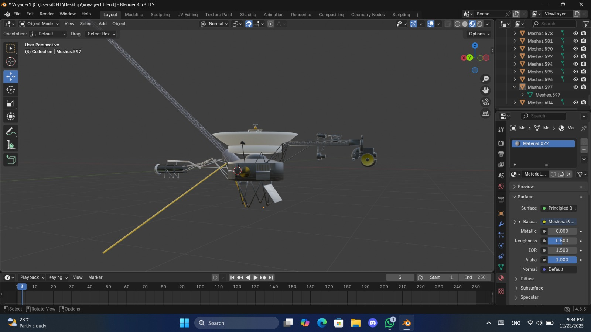

# 🚀 Voyager Simulator (Unity)

## 📌 Project Description
🚀 Voyager Simulator is a Unity-based 3D space exploration project that recreates the Voyager spacecraft experience. It features realistic movement, space environments, and interactive elements, allowing users to explore and visualize deep-space missions.

## 🎮 Features
- Spaceship control
- Planet exploration
- Realistic physics

## 🛠️ Technologies
- Unity
- C#
- Blender

## 📸 Screenshots

## 📊 Project Progress

> **Current Phase:** Phase 2 — Simulation Coding  
> **Last Updated:** April 23, 2026  
> **Overall Status:** 🟡 In Progress

### ✅ Phase 1 — 3D Asset Creation (Completed)

| Task | Status |
|------|--------|
| 3D Voyager spacecraft model — Blender | ✅ Done |
| Titan IIIE rocket model — Blender | ✅ Done |
| Asset preparation & scene setup | ✅ Done |

---

### 🚀 Titan IIIE Rocket Model

The Titan IIIE rocket model was created in Blender as part of the Phase 1 asset development. It represents the historic launch vehicle used by NASA to send the Voyager 1 and Voyager 2 spacecraft into space in 1977.

- **Height:** ~48 meters (with Centaur upper stage)
- **Stages:** Two-stage core (Titan III) plus a Centaur D-1T upper stage
- **Role in Simulator:** Used to recreate the liftoff and staging sequence, providing a realistic launch experience before transitioning to deep-space exploration
- **Status:** Fully modeled and integrated into the Unity scene

---

### 🔲 Phase 2 — Simulation Coding (Current)

> Assets are finalized. Coding phase is now starting.

## 👨‍💻 Authors

<table>
  <tr>
    <td align="center"><b>👤 Kevin Hirosh</b> Project Lead</td>
    <td align="center"><b>👤 Manula</b> Developer</td>
    <td align="center"><b>👤 Dinith</b> Developer</td>
    <td align="center"><b>👤 Thisara</b> Project Manager</td>
    <td align="center"><b>👤 Sithuni</b> Developer</td>
    <td align="center"><b>👤 Kithmi</b> Developer</td>
  </tr>
</table>

